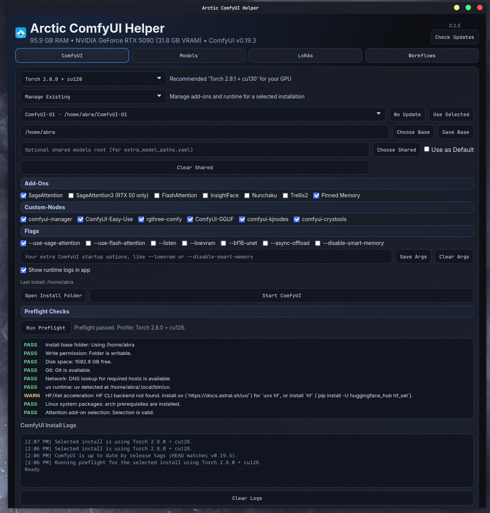

  

<h1 align="center">Arctic ComfyUI Helper</h1>

  For users who want to install and manage ComfyUI with different add-ons and custom nodes very easily on Windows and Linux, plus get the right models and LoRAs without guesswork.

  
  
  
  
  
  

  
  
  

---

## 📚 Overview

Think of it as:
- A built-in **ComfyUI installer** for desktop workflows (easy setup from inside the app)
- A curated model/LoRA catalog matched to your hardware tiers
- A one-click downloader that places assets into the correct ComfyUI folders

---

## 🧩 Core Features

- 🛠️ **ComfyUI install module** (uv-managed Python + selectable add-ons/custom nodes)
- 🧠 **Tier-aware catalog** that filters by your GPU VRAM and system RAM
- 📦 **Auto-dependency downloads** (text encoders, CLIPs, upscalers, and other required files)
- 🗂️ **Smart file placement** into the correct ComfyUI subfolders
- 📈 **Live download progress** with active/completed transfer tracking
- 🔐 **Optional Civitai token support** for authenticated LoRA downloads
- 🖼️ **LoRA preview + metadata** in-app (description, triggers, creator link)
- ♻️ **Auto-update support** through GitHub Releases manifest
- 🧵 **System tray controls** to Start/Stop ComfyUI even when the main window is hidden

---

## 🧰 ComfyUI Installer Highlights

Inside the **ComfyUI** tab, you can:

- Select a base folder and install a fresh ComfyUI instance
- Manage an existing ComfyUI installation
- Use automatic Torch/CUDA recommendation based on detected NVIDIA GPU
- Override Torch stack manually from dropdown
- Toggle add-ons and custom nodes from UI

### Available Add-Ons

- SageAttention
- SageAttention3 (RTX 50-series only)
- FlashAttention
- InsightFace
- Nunchaku
- Trellis2 (requires Torch 2.8.0 + cu128 or newer)
- Pinned Memory (enabled by default)

### Available Custom Nodes

- comfyui-manager
- ComfyUI-Easy-Use
- rgthree-comfy
- ComfyUI-GGUF
- comfyui-kjnodes

---

## 🚀 Getting Started

1. Download the latest package for your OS from this repo's **Releases** page (`.exe` for Windows, `.deb` for Ubuntu/Debian/Mint, `.rpm` for Fedora, and `.pkg.tar.zst` for Arch Linux).
2. Run the app. It is a **standalone desktop app**.
3. In **ComfyUI** tab, use **Install New** (or **Manage Existing**) if you want the app to install/manage ComfyUI itself.
4. In **Models** / **LoRAs**, select your existing ComfyUI folder to download assets.
5. Optional advanced logging: launch from terminal with `--nerdstats`  
   Examples: `.\Arctic-ComfyUI-Helper.exe --nerdstats` (Windows), `./Arctic-ComfyUI-Helper --nerdstats` (Linux)

That is it. Pick your setup, click, and the app handles the rest.

---

## 🖼️ Demo Preview

---

## 🔄 Auto-Updates

On startup, the app checks:

the latest update manifest from this repository's GitHub Releases.

If a newer version is found, the app downloads, verifies checksum, replaces binary, and restarts.

---

## ✅ Requirements

- Latest NVIDIA drivers installed
- Internet connection (for catalog, model files, and optional installer tasks)
- For some Civitai LoRAs: a valid Civitai API token

---

## 💡 Usage Tips

- If a LoRA says unauthorized, add your Civitai token in-app and save it.
- If you run multiple ComfyUI installs, use the ComfyUI tab's install/manage mode and detected installs list.

---

## 🆘 Need Help?

Open `Issues` -> `New issue`, then choose:
- **Cross-Platform Bug Report** for problems and errors
- **Feature Request** for ideas and improvements

Include:
- Platform and version (Windows or Linux distro/version)
- Package type used (`.exe`, `.deb`, `.rpm`, or `.pkg.tar.zst`)
- What you clicked
- What you expected
- What happened
- Any log lines shown in the app
- If possible, run with `--nerdstats` and include the exact terminal logs

---

## 🧊 Author

Burce Boran 🎥 Asset Supervisor / VFX Artist | 🐧 Arctic Latent

---

Copyright (c) 2026 Arctic Helper. All Rights Reserved.

This software is proprietary and closed-source.

You may download and use for personal use only. Redistribution, modification, reverse engineering, or commercial use of this software or any included assets is prohibited without written permission from the copyright holder.

The software is provided “as is” without warranty of any kind.
