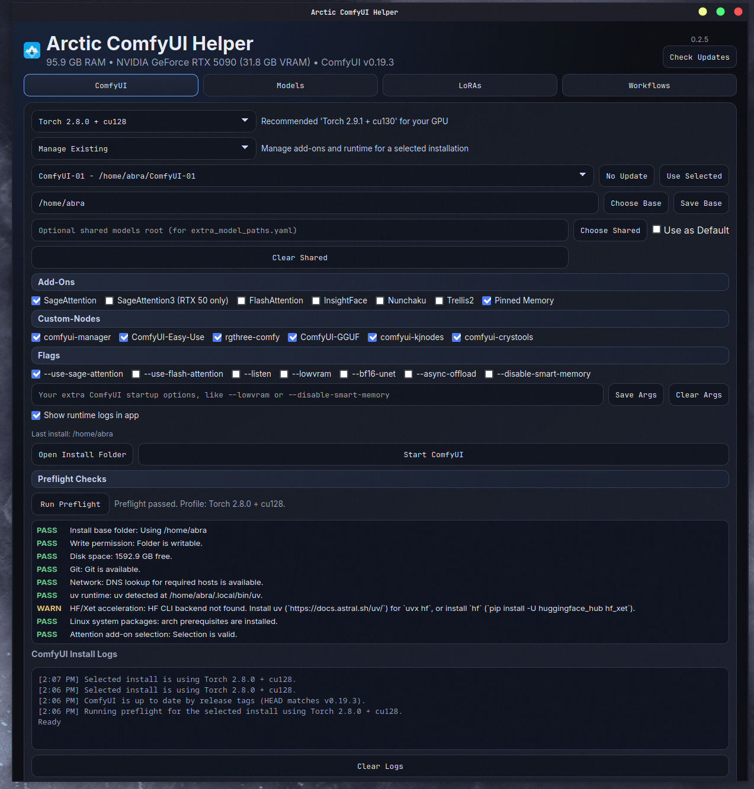

<p align="center">
  
</p>

<h1 align="center">Arctic ComfyUI Helper</h1>

<p align="center">
  A Windows and Linux companion for installing and managing ComfyUI, choosing hardware-appropriate setups, and downloading the right models and LoRAs without guesswork.
</p>

<p align="center">
  
  
  
  
  
  
  
  
</p>

<p align="center">
  
  
  
  
  
</p>

---

## 📚 Overview

Arctic ComfyUI Helper mirrors the builds used in Arctic Latent tutorials, reducing setup friction and helping you choose assets that fit your hardware.

It includes:

- A built-in **ComfyUI installer and manager**
- A curated model and LoRA catalog matched to hardware tiers
- One-click downloads into the correct ComfyUI folders
- Hardware-aware Torch and accelerator recommendations
- Runtime controls, logs, and system-tray integration

---

## ✨ New in v0.2.6

- Added a public binary Nix flake for NixOS and other `x86_64-linux` Nix systems
- Added GPU selection on multi-adapter systems, with compatible NVIDIA CUDA, AMD ROCm, and Intel XPU profiles
- Unified Windows and Linux development for more consistent cross-platform behavior
- Updated Linux AMD profiles for ROCm 7.2
- Improved NVIDIA detection on mixed-GPU and headless Linux systems
- Made ComfyUI update checks asynchronous so slow Git operations do not freeze startup
- Improved Windows runtime-output handling for non-UTF-8 output and disabled in-app logs
- Added signed release manifests and stricter release verification
- Added native Arch Linux packages to GitHub Releases; AUR publishing has been removed

---

## 🧩 Core Features

- 🛠️ **ComfyUI installation and management** with uv-managed Python, selectable add-ons, and custom nodes
- 🧠 **GPU-aware install profiles** for NVIDIA CUDA and supported AMD ROCm and Intel XPU configurations
- 🎛️ **Multi-GPU selection** with Torch choices filtered for the selected adapter
- 🧭 **Guided AMD/ROCm onboarding** with distro-aware Linux help and readiness checks
- 🚩 **Flexible launch controls** for options such as `--listen`, SageAttention, and FlashAttention
- 🧠 **Tier-aware catalog** filtered by GPU VRAM and system RAM
- 📦 **Automatic dependency downloads** for text encoders, CLIPs, upscalers, and other required files
- 🗂️ **Smart file placement** into the correct ComfyUI subfolders
- 📈 **Live and queued download progress** with multi-select model downloads
- 🔐 **Optional Civitai token support** for authenticated LoRA downloads
- 🖼️ **LoRA previews and metadata**, including descriptions, triggers, and creator links
- 🖥️ **Live runtime console** with filtering for ComfyUI processes launched by Arctic Helper
- ♻️ **Verified updates** using signed GitHub release manifests and SHA-256 checksums
- 🧵 **System tray controls** for starting and stopping ComfyUI while the main window is hidden

---

## 🧰 ComfyUI Installer Highlights

Inside the **ComfyUI** tab, you can:

- Select a base folder and install a fresh ComfyUI instance
- Manage an existing ComfyUI installation
- Use automatic Torch and accelerator recommendations based on detected hardware
- Select a GPU explicitly on systems with multiple adapters
- Override the Torch stack manually
- Save custom startup arguments
- Configure launch-time flags separately from install-time add-ons
- Toggle supported add-ons and custom nodes from the UI

### Available Add-Ons

- SageAttention
- SageAttention3 (RTX 50-series only)
- FlashAttention
- InsightFace
- Nunchaku
- Trellis2 (requires Torch 2.8.0 + cu128 or newer)
- Pinned Memory (enabled by default)

### Available Custom Nodes

- comfyui-manager
- ComfyUI-Easy-Use
- rgthree-comfy
- ComfyUI-GGUF
- comfyui-kjnodes

---

## 🚀 Installation

Download the latest package from [GitHub Releases](https://github.com/ArcticLatent/Arctic-Helper/releases/latest).

Only `x86_64` Linux packages are currently provided.

### Windows 10/11

Download `Arctic-ComfyUI-Helper.exe` and run it directly. The current Windows release is a standalone executable and does not require an installer.

Optional terminal logging:

```powershell
.\Arctic-ComfyUI-Helper.exe --nerdstats
```

### Ubuntu, Debian, and Linux Mint

```bash
sudo apt install ./arctic-comfyui-helper_*_amd64.deb
```

### Fedora

```bash
sudo dnf install ./arctic-comfyui-helper-*.x86_64.rpm
```

### Arch Linux

Download the native `.pkg.tar.zst` asset from the release and install it with:

```bash
sudo pacman -U ./arctic-comfyui-helper-*-x86_64.pkg.tar.zst
```

An AUR package is no longer published or maintained. Use the native Arch package attached to each GitHub release.

### Flatpak

```bash
flatpak install --user ./arctic-comfyui-helper-*-x86_64.flatpak
flatpak run io.github.ArcticHelper
```

### NixOS / Nix

Run without installing:

```bash
nix run 'tarball+https://github.com/ArcticLatent/Arctic-Helper/releases/latest/download/arctic-comfyui-helper-nix-x86_64.tar.gz'
```

Install into your user profile:

```bash
nix profile add 'tarball+https://github.com/ArcticLatent/Arctic-Helper/releases/latest/download/arctic-comfyui-helper-nix-x86_64.tar.gz'
```

Launch it with:

```bash
arctic-comfyui-helper
```

Update the profile installation with:

```bash
nix profile upgrade --refresh arctic-comfyui-helper
```

For a declarative NixOS configuration, use the same tarball URL as a flake input and add `inputs.arctic-helper.packages.${pkgs.system}.default` to `environment.systemPackages`.

The in-app updater is disabled for Nix installations because the Nix store is immutable. Update through Nix instead.

### After Installation

1. Open the **ComfyUI** tab and choose **Install New** or **Manage Existing**.
2. In **Models** or **LoRAs**, select your ComfyUI folder before downloading assets.
3. Configure optional launch flags, add-ons, custom nodes, and your Civitai token as needed.

---

## 🖼️ Demo Preview



---

## 🔄 Updates and Release Verification

On supported installations, Arctic ComfyUI Helper checks the release manifests published in this repository.

- Windows uses `update.json`.
- Linux packages use `linux-release.json` to select the matching Debian, Fedora, or Arch artifact.
- Release manifests are authenticated with Ed25519 signatures.
- Downloaded application files are verified against SHA-256 checksums before installation.
- Missing or invalid signatures and checksum mismatches are rejected.
- Nix installations are updated through `nix profile`, not by modifying the Nix store.

---

## ✅ Requirements

- Windows 10/11 or a supported `x86_64` Linux distribution
- Current drivers for your NVIDIA, AMD, or Intel GPU setup
- An internet connection for the catalog, model downloads, and installer tasks
- Sufficient disk space for ComfyUI, Python environments, models, and LoRAs
- A Civitai API token for assets that require authentication

---

## 💡 Usage Tips

- If a LoRA reports an authorization error, add your Civitai token in the app and save it.
- If you use multiple ComfyUI installations, select the intended installation before downloading assets.
- Use the runtime console to inspect a ComfyUI process launched by Arctic Helper.
- Launch `arctic-comfyui-helper --nerdstats` on Linux or use the Windows command above for advanced diagnostic output.

---

## 🆘 Need Help?

Open an [issue](https://github.com/ArcticLatent/Arctic-Helper/issues/new) and include:

- Operating system and version
- Package type: `.exe`, `.deb`, `.rpm`, `.pkg.tar.zst`, `.flatpak`, or Nix
- What you clicked
- What you expected
- What happened
- Relevant in-app log lines
- Exact terminal output from `--nerdstats`, when possible

---

## 🙏 Special Thanks

Thanks to [visualbruno](https://github.com/visualbruno) for the [Trellis2 wrapper](https://github.com/visualbruno/ComfyUI-Trellis2).

---

## 🧊 Author

Burce Boran 🎥 Asset Supervisor / VFX Artist | 🐧 Arctic Latent

[](https://youtube.com/@ArcticLatent)
[](https://patreon.com/ArcticLatent)
[](https://huggingface.co/arcticlatent)
[](https://vimeo.com/1044521891)

---

## Support Project

[](https://buymeacoffee.com/arcticlatent)

---

## License

Copyright (c) 2026 Arctic Helper. All Rights Reserved.

This software is proprietary and closed-source. You may download and use it for personal use only. Redistribution, modification, reverse engineering, or commercial use of this software or any included assets is prohibited without written permission from the copyright holder.

The software is provided “as is” without warranty of any kind.
